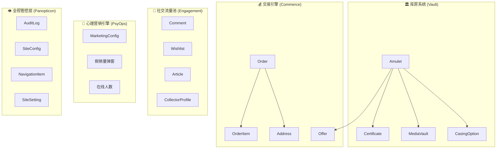

# 🏗️ 暹罗御藏 (Siam Treasures) 系统架构文档

> **版本**: 4.0 | **最后同步**: 2026-03-14
> **Status**: 生产准备就绪

---

## 1. 系统级拓扑图

平台分为 **5 大子系统**：



| 子系统 | 核心模型 | 职责 |
|:---|:---|:---|
| **Vault** | Amulet, Certificate, MediaVault, CasingOption | 商品护城河（多语、溯源、360° 视频） |
| **Commerce** | Order, OrderItem, Address, Offer | DTC + B2B + 私洽交易闭环 |
| **Engagement** | Comment, Wishlist, Article, CollectorProfile | 社交证明与内容营销 |
| **PsyOps** | MarketingConfig | 假流量引擎（弹窗 + 人数模拟） |
| **Panopticon** | AuditLog, SiteConfig, NavigationItem, SiteSetting | 审计、CMS、导航管理 |

---

## 2. 技术架构栈

```
┌─────────────────────────────────────────────────────┐
│                    浏览器 (Client)                     │
│  React 19 · Framer Motion · Swiper · Tailwind v4    │
│  react-hot-toast · next-cloudinary (上传组件)         │
├─────────────────────────────────────────────────────┤
│              Next.js 16 App Router                    │
│  ┌──────────────┐  ┌──────────────┐                  │
│  │ Server Comp. │  │ Client Comp. │                  │
│  │ (page.tsx)   │  │ (*Client.tsx)│                  │
│  └──────┬───────┘  └──────┬───────┘                  │
│         │                  │                          │
│  ┌──────┴──────────────────┴───────┐                 │
│  │     Server Actions (actions.ts)  │                 │
│  │     + AuditLog (logger.ts)       │                 │
│  └──────────────┬──────────────────┘                 │
│                 │                                     │
│  ┌──────────────┴──────────────────┐                 │
│  │    Prisma ORM (db.ts)            │                 │
│  │    SQLite (prisma/dev.db)        │                 │
│  └──────────────────────────────────┘                 │
│                                                       │
│  ┌────────────┐  ┌───────────────┐                   │
│  │ NextAuth v4│  │  Cloudinary   │                   │
│  │ JWT + Cred.│  │  CDN 图床      │                   │
│  └────────────┘  └───────────────┘                   │
└─────────────────────────────────────────────────────┘
```

---

## 3. 物理目录结构

```
thai-amulet-vault/
├── prisma/
│   ├── schema.prisma          # 19 个数据模型定义
│   ├── dev.db                 # SQLite 数据库文件
│   └── seed.ts                # 数据库种子脚本
│
├── src/
│   ├── api/
│   │   ├── db.ts              # Prisma 实例 + CRUD + 自动种子机制
│   │   ├── db.json            # 原始数据备份 (灾难恢复的唯一基准)
│   │   ├── logger.ts          # 审计日志写入器
│   │   └── settings.ts        # SiteSetting 读写
│   │
│   ├── app/
│   │   ├── layout.tsx         # 全局 Layout (导航/Footer/Toast/Providers)
│   │   ├── page.tsx           # 首页 (Server Component)
│   │   ├── actions.ts         # ⚡ 全站写操作中枢 (Server Actions)
│   │   ├── admin/             # 后台管理 (AdminClient.tsx)
│   │   ├── amulet/[id]/       # 圣物详情页 (动态路由)
│   │   ├── collections/       # 全量浏览页
│   │   ├── cart/              # 购物车
│   │   ├── checkout/          # 结算页 (DTC/B2B 融合)
│   │   ├── auth/              # 登录/注册
│   │   ├── account/           # 用户中心
│   │   ├── blog/              # 资讯/博客
│   │   ├── story/             # 品牌故事
│   │   ├── login/             # 旧版登录
│   │   └── quick-order/       # 快速下单
│   │
│   ├── components/
│   │   ├── TopNav.tsx         # 顶部导航 (含汉堡菜单)
│   │   ├── Footer.tsx         # 页脚
│   │   ├── AmuletCard.tsx     # 圣物卡片
│   │   ├── AmuletShowcase.tsx # 客户端筛选器 (核心复杂组件)
│   │   ├── CommentsList.tsx   # 评论列表
│   │   ├── InstagramCarousel.tsx # 买家秀轮播
│   │   ├── FakeOrderToast.tsx # 假销量弹窗引擎
│   │   ├── VisitorCounter.tsx # 在线人数计数器
│   │   ├── ClientProviders.tsx # Provider 封装
│   │   └── admin/
│   │       └── CloudinaryUploader.tsx # Cloudinary 上传组件
│   │
│   ├── lib/
│   │   └── auth.ts            # NextAuth 配置 (JWT + Credentials)
│   │
│   ├── contexts/              # React Context (i18n + Cart)
│   ├── types/                 # TypeScript 类型定义
│   └── middleware.ts          # 路由中间件 (认证守卫)
│
├── scripts/
│   ├── seedAccounts.ts        # 创建 4 个测试账户
│   ├── seed.mjs               # 初始化圣物数据
│   ├── reupload-from-json.js  # 灾难恢复：批量修复图床
│   ├── migrate-images.js      # 图片迁移工具
│   ├── migrate-images.mjs     # 图片迁移 (ESM 版)
│   ├── reupload-images.js     # 图片重传工具
│   ├── count.js               # 统计 placeholder 数量
│   ├── get-five-urls.js       # 获取样本 URL
│   ├── get-one-url.js         # 获取单条 URL
│   └── check-urls.py          # URL 可用性检查
│
├── docs/superpowers/specs/    # SSOT 文档库
│   ├── PRD.md                 # 产品需求文档
│   ├── TDD.md                 # 技术设计文档
│   ├── ARCHITECTURE.md        # 本文件
│   ├── UI_ASSETS_MAPPING.md   # 视觉资产映射
│   └── USER_GUIDE.md          # 运营操作手册
│
├── PROJECT.md                 # 项目元数据中心 (SSOT 总纲)
├── README.md                  # 项目入门说明
├── start-dev.bat              # Windows 一键启动脚本
├── next.config.ts             # Next.js 配置 (images.unoptimized: true)
├── .env.local                 # 环境变量 (Cloudinary + DB)
└── package.json               # 依赖清单
```

---

## 4. 数据流转图

### 4.1 图片上传流程
```
设计师出图 → 管理员进入后台 → 点击 CloudinaryUploader
    → Cloudinary 无签名直传 (upload_preset: siam_amulet_preset)
    → 返回 secure_url
    → 写入 hidden input (imageUrl)
    → 点击保存 → Server Action (updateAmuletAction)
    → Prisma 更新 Amulet.imageUrl
    → revalidatePath() 刷新前端缓存
    → toast.success("档案更新成功！")
```

### 4.2 订单状态机
```
PENDING → (Stripe Webhook) → PAID → (管理员录入物流) → SHIPPED → DELIVERED
```

### 4.3 认证流程
```
用户输入邮箱+密码 → NextAuth Credentials Provider
    → Prisma 查询 User → bcrypt.compare 校验
    → 签发 JWT (含 id, role, permissions)
    → Session 回调注入角色信息
    → Server Actions 通过 getServerSession() 鉴权
```

---

## 5. 开发纪律底线

1. **SSOT 原则**: 新 Agent/开发者加入，必须先读 `PROJECT.md` → 本文件 → `PRD.md`
2. **禁飞区**:
   - 严禁修改 `globals.css` 中的 `#0d0c0b` 和 `#c4a265` 主色调（除非用户明确同意）
   - 严禁绕过 `actions.ts` 直接操作数据库（会丢失审计日志）
   - 严禁在 `.bat` 文件中写中文（CMD 编码崩溃）
3. **渲染隔离**: 数据获取在 `page.tsx` (Server Component) 完成，UI 交互在 `*Client.tsx` (Client Component) 处理
4. **图片规范**: 所有业务图片通过 Cloudinary 托管，`next.config.ts` 已设置 `unoptimized: true` 绕过 Next.js 图片代理的私有 IP 限制

---

## 6. 维护脚本索引

| 脚本 | 命令 | 使用场景 |
|:---|:---|:---|
| 创建测试账户 | `npx tsx scripts/seedAccounts.ts` | 初始化或重置测试用户 |
| 初始化数据 | `npx tsx prisma/seed.ts` | 空数据库初始化 |
| 灾难恢复 | `node scripts/reupload-from-json.js` | 批量图床链接失效时 |
| 数据库迁移 | `npx prisma migrate dev` | Schema 变更后 |
| 数据库可视化 | `npx prisma studio` | 直接查看/编辑数据 |
| 启动服务 | 双击 `start-dev.bat` | 日常开发 |

---

## 7. 已知技术债与排雷记录

| 日期 | 问题 | 根因 | 修复方案 |
|:---|:---|:---|:---|
| 2026-03-14 | Cloudinary 图片加载失败 | VPN 将 `res.cloudinary.com` 解析到私有 IP 198.18.0.72 | `next.config.ts` 设置 `images.unoptimized: true` |
| 2026-03-14 | `start-dev.bat` 秒退 | BAT 文件含中文导致 CMD 编码崩溃 | 重写为纯英文 |
| 2026-03-14 | 图片更新后台无反应 | 缺乏 try-catch 和用户反馈 | 集成 react-hot-toast + 服务端日志 |
| 2026-03-13 | Next.js Image 400 错误 | 旧 Cloudinary 账号 URL 残留 | `reupload-from-json.js` 批量修复 |

---
*ARCHITECTURE v4.0 - Synced 2026-03-14*
